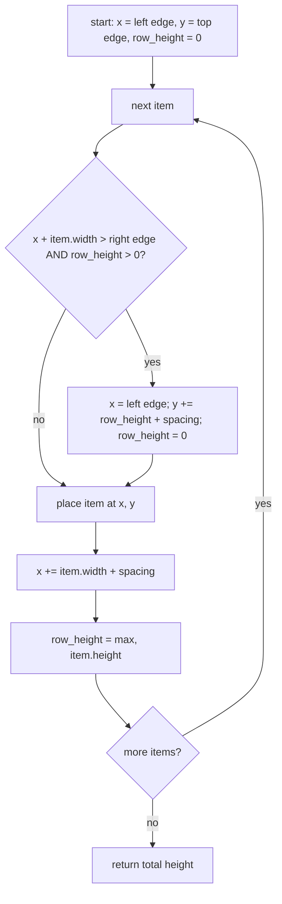

# Flow Layout — Flow

**About:** [description](../__about/flow_layout.md)

## Algorithm

Pseudocode (language-neutral):

    x, y, row_height ← left edge, top edge, 0
    FOR EACH item, left to right:
        IF x + item.width > right edge AND row_height > 0:
            x ← left edge
            y ← y + row_height + spacing
            row_height ← 0
        IF apply: place item at (x, y) with its own size hint
        x ← x + item.width + spacing
        row_height ← max(row_height, item.height)
    RETURN y + row_height  (the layout's total height for this width)

The same routine runs twice for different purposes: `heightForWidth()` calls
it with `apply = False` just to learn how tall a given width would need to
be (Qt asks this before it commits to a geometry), and `setGeometry()` calls
it with `apply = True` to actually move the child widgets. This is why the
minimum is the **widest single item**, not the row sum: nothing in the
routine ever adds widths across items unless they end up sharing a row.
