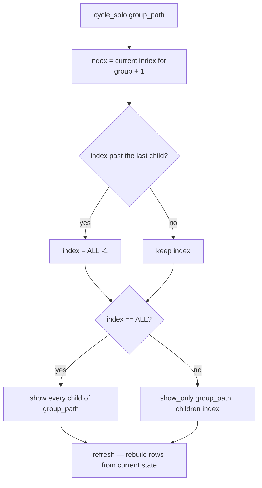

# Parts Panel — Flow

**About:** [description](../__about/parts_panel.md)

## Algorithm — Solo Cycling

Pseudocode (language-neutral — this is the "three legend terms on one axis
tip, one shown at a time" case from [Making Models](../../MODELS.md), reduced
to one button):

    index ← current solo index for this group, default ALL, then +1
    IF index has passed the last child:
        index ← ALL
    store index for this group

    IF index == ALL:
        FOR EACH child of the group: make it visible
    ELSE:
        show_only(group_path, children[index])   # hides every other child

    refresh()   # rebuild the row widgets — otherwise the child checkboxes
                # would still show the previous, now-stale visibility state

`reload()` and `refresh()` stay separate for the same reason this cycle
exists: solo state is meaningful across a `refresh()` (the button must keep
reading `2/3`) but meaningless across a scene change, where `reload()` clears
it — collapsing the two would reset the solo indicator on every click.
