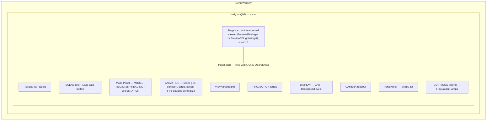
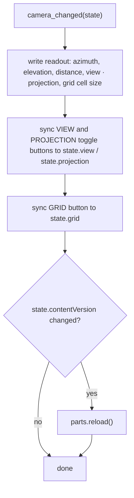

# Demo Window — Flow

**About:** [description](../__about/window.md)

## Panel Layout (zones, top to bottom, one scrolling column)

The single scroll area is a deliberate choice: stacking the sections
unscrolled sets a ~770 px floor on the window's height, and a second nested
scroll area just for the parts list would give the user two scrollbars for
one logical list — see Design Decisions in the [about](../__about/window.md) doc.

## Camera Readout & Parts Reload

Pseudocode:

    ON camera_changed(state):
        readout ← azimuth, elevation, distance, view · projection, grid cell size
        sync the VIEW and PROJECTION toggles to state.view / state.projection
        sync the GRID button to state.grid
        IF state.contentVersion changed → parts.reload()

The content-version check is why the parts list is correct after loading a
**file**: model loading is asynchronous, so "right after calling
`load_model`" is not a moment at which the parts exist. The viewer bumps the
version when content is actually in place, and the panel reloads then.

## Playback Readout

Pseudocode:

    ON animation_changed(state):
        enable / disable the transport and the scrub  ← state.scene is not None
        the play button reads "Pause" while playing
        move the scrub to state.progress             (guarded — see below)
        sync the SPEED toggle; write scene · time · frame

The scrub slider is both an input and a readout, so a guard flag
(`_syncing_scrub`) distinguishes the panel's own `setValue` call from the
user dragging it; without it the two would be indistinguishable and every
report would seek.

## Renderer Swap (`set_renderer`)

    old ← self.viewer; disconnect its signals; remove + delete it
    self.viewer ← factory()   # the other renderer's widget class
    connect signals; mount it in the stage; point parts panel at it
    enable/disable the Load-file button per the new renderer's capability
    re-show the model on the new widget IF one was shown (suppressing the
        "clear the animation" side effect this would normally trigger)
    replay the primitive spec IF one was shown
    replay the animation IF one was loaded, resuming playback if it was playing
    reset the grid toggle; focus the viewer

Carrying content, model state and animation across the swap is the point of
having a renderer switch at all — it is how the same scene gets compared on
both back ends.
