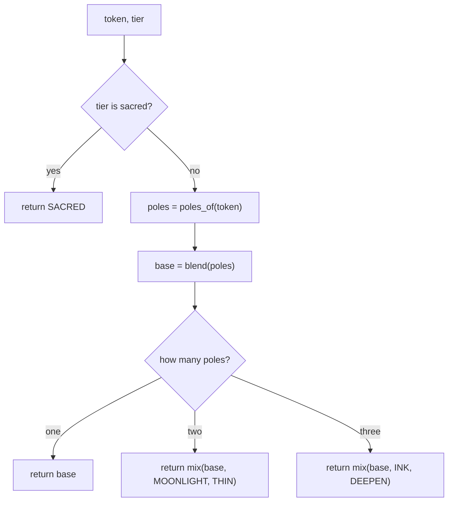

# Axis Colours — Flow

**About:** [description](../__about/axis_colors.md)

## Algorithm

Pseudocode — the colour rule:

    FUNCTION color_for(token, tier):
        IF tier == "sacred" -> RETURN SACRED
        poles <- the pole hues token's signed letters name, in written order
        base  <- per-channel mean of poles                  # blend()
        IF len(poles) == 1 -> RETURN base                    # the sealed pole itself
        IF len(poles) == 2 -> RETURN mix(base, MOONLIGHT, THIN)
        RETURN mix(base, INK, DEEPEN)

    FUNCTION derive_all():
        FOR EACH letters IN (1, 2, 3):
            FOR EACH token IN cube_tokens(letters):
                colors[token] <- color_for(token, tier_of(token))
        verify_palette(colors)                                # collision check, below
        RETURN colors

Pseudocode — the collision check:

    FUNCTION verify_palette(colors):
        FOR EACH (token, color) WITH more than one letter:
            FOR EACH pole, pole_color IN POLE_COLORS:
                IF distance(color, pole_color) < minPoleDistance -> COLLISION
        FOR EACH pair (token, other) OF colors, token < other:
            IF distance(colors[token], colors[other]) < minSeatDistance -> COLLISION
        IF any COLLISION -> raise ValueError listing them all
