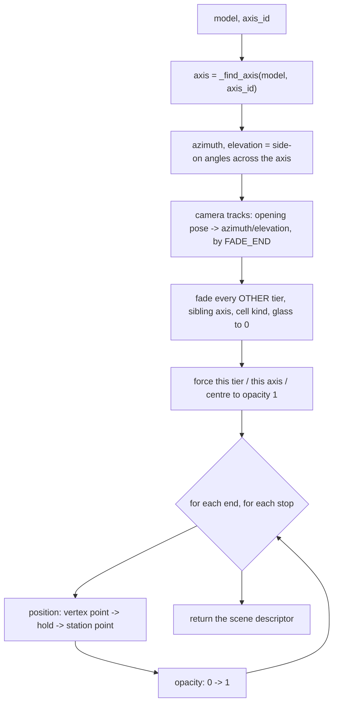

# Cinematics — Flow

**About:** [description](../__about/cinematics.md)

## Algorithm

Pseudocode:

    FUNCTION build_five_stations_scene(model, axis_id, duration=8.0):
        axis   <- the model's axis whose id or opposite matches axis_id
        length <- this axis's tier length * model size
        azimuth, elevation <- angles of a camera looking ACROSS the axis's
            positive direction (basis_from's "right" vector), not down it --
            looking down an axis collapses it to a point

        tracks <- [
            camera.azimuth    opening(35 deg) -> azimuth,   eased, ends at FADE_END
            camera.elevation  opening(22 deg) -> elevation, eased, ends at FADE_END
        ]
        FOR EACH group that is NOT this axis / this tier / the centre:
            tracks += opacity 1 -> 0, ending at FADE_END      # "the cube fades away"
        tracks += opacity of this tier group, this axis, the centre forced to 1

        FOR EACH end IN (positive, negative):
            FOR EACH stop IN (luminous, fallen):
                vertex_point  <- direction * length
                station_point <- direction * length * radial_factor[stop]
                tracks += part.position: vertex_point (hold to FADE_END) -> station_point (at SLIDE_END)
                tracks += part.opacity:  0 -> 1 (by SLIDE_END)            # the bead grows in

        RETURN { name, label, duration, content: model/cube view, tracks }
