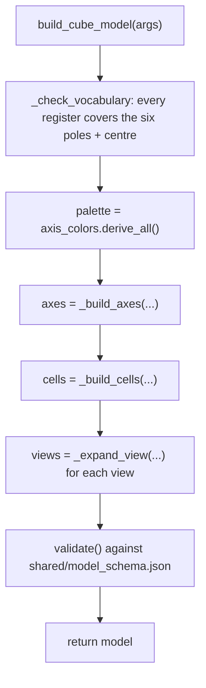

# Cube Model — Flow

**About:** [description](../__about/cube_model.md)

## Algorithm

Pseudocode — the builder:

    FUNCTION build_cube_model(..., sacred="+x+y+z", ...):
        _check_vocabulary(vocabulary, registers)          # fail here, not as a blank label
        sacred_ends <- {sacred_token, its opposite} if sacred else {}
        palette     <- axis_colors.derive_all()
        dress(token) <- SACRED if token in sacred_ends else palette[token]

        axes  <- FOR letters IN (1, 2, 3):
                     FOR (positive, negative) IN cube_axes(letters):
                         tier <- "sacred" if positive is the sacred token else tier_of(positive)
                         axis { id, tier, ends: [dress(positive), dress(negative)] }

        cells <- FOR letters IN (1, 2, 3):
                     FOR token IN cube_tokens(letters):
                         cell { position: token_vector(token) * size/2, color: dress(token) }
                 cells += the centre cell, always dressed SACRED

        views <- FOR EACH view IN (given or DEFAULT_VIEWS):
                     expand short group keys ('secondary', 'glass') to full part
                     paths, defaulting every OTHER group to opacity 0

        RETURN validate({ name, label, root, size, registers, axes, cells, glass, views })

Pseudocode — the words a seat says:

    FUNCTION _names(token, registers, vocabulary):
        FOR EACH register:
            IF token is centre -> the register's centre pair
            poles    <- the signed letters of the token
            luminous <- join(vocabulary[register][pole].luminous for each pole, " . ")
            fallen   <- join(vocabulary[register][pole].fallen   for each pole, " . ")
