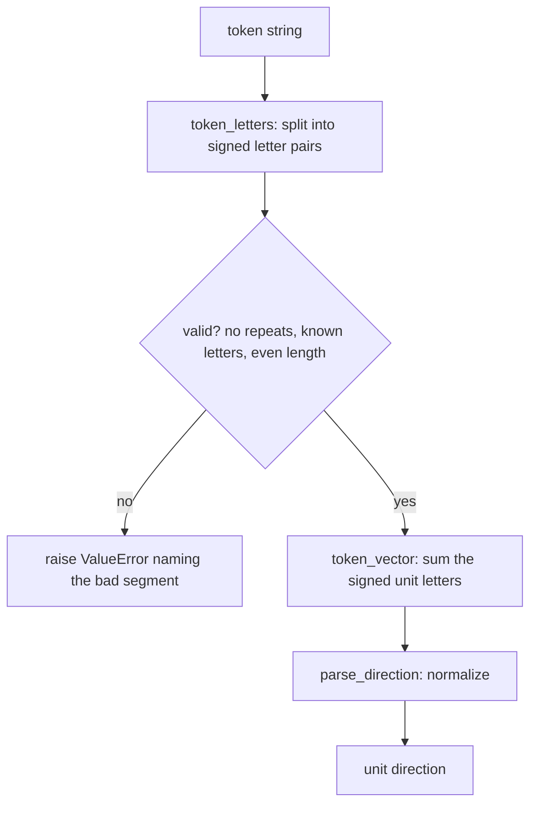

# Directions — Flow

**About:** [description](../__about/directions.md)

## Algorithm

Pseudocode — the grammar:

    FUNCTION token_letters(token):
        IF token is empty OR odd length -> fail
        FOR EACH 2-character chunk (sign, letter) IN token:
            IF sign not in "+-" OR letter not a known axis letter -> fail, naming the chunk
            IF letter already seen in this token -> fail (repeated letter)
            parsed += (letter, +1 or -1)
        RETURN parsed

    FUNCTION token_vector(token):
        RETURN the sum of LETTERS[letter] * sign, for each (letter, sign) in token_letters(token)

    FUNCTION canonical_token(token):
        RETURN the token's own letters, re-written in the cube's fixed x, y, z order

    FUNCTION tier_of(token):
        RETURN primary/secondary/tertiary keyed by len(token_letters(token)) -- never "sacred"

Pseudocode — the combinatorial generators:

    FUNCTION cube_tokens(letters):                          # 6 / 12 / 8 tokens
        FOR EACH combination of `letters` distinct axis letters:
            FOR EACH assignment of +/- signs to that combination:
                yield the token, letters written in canonical order

    FUNCTION vertex_neighbors(vertex):                       # 3 results
        signed <- token_letters(vertex)                       # must be 3 letters
        FOR EACH index IN 0..2:
            flip the sign of signed[index] only, keep the other two
            yield canonical_token(the flipped letters)

    FUNCTION hidden_from(vertex):                             # 7 results
        antipode <- token_letters(opposite_token(vertex))      # the far vertex's own letters
        FOR EACH count IN (1, 2, 3):
            FOR EACH combination of `count` of the antipode's 3 letters:
                yield canonical_token(that combination)
        # antipode itself (3), its 3 adjacent edges (2 each), its 3 adjacent faces (1 each) = 7
