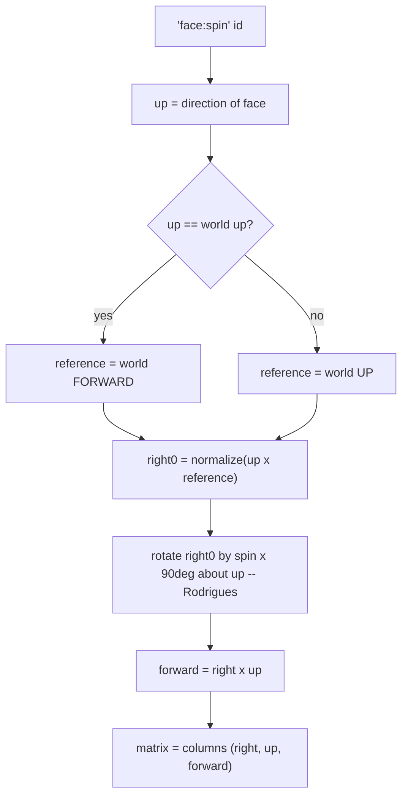

# Orientations — Flow

**About:** [description](../__about/orientations.md)

## Algorithm

Pseudocode:

    FUNCTION orientation_ids():
        RETURN "<face>:<spin>" for face in FACE_ORDER, for spin in 0..3   # 6 x 4 = 24

    FUNCTION orientation(id):
        face, spin <- split id
        up        <- parse_direction(face)
        reference <- world FORWARD if up is (near enough) world UP, else world UP
        right0    <- normalize(up x reference)
        angle     <- spin * 90 degrees
        right     <- right0 * cos(angle) + (up x right0) * sin(angle)      # Rodrigues about `up`
        forward   <- right x up
        RETURN basis_matrix(right, up, forward)

    FUNCTION snap_angles(direction):
        x, y, z    <- parse_direction(direction)
        horizontal <- hypot(x, z)
        azimuth    <- atan2(x, z) in degrees, or 0 if horizontal is ~0
        elevation  <- atan2(y, horizontal) in degrees,
                      or +-89.99 degrees (the pole limit) if horizontal is ~0
        RETURN (azimuth, clamp(elevation, +-89.99 degrees))
