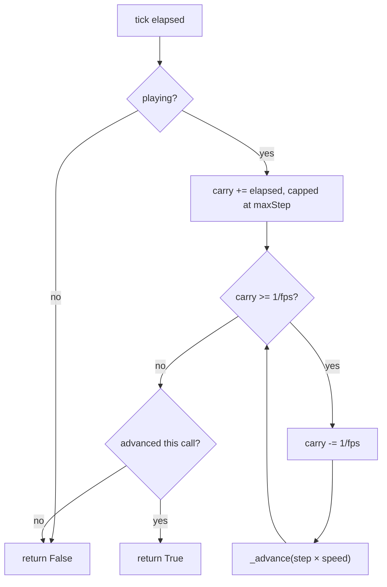
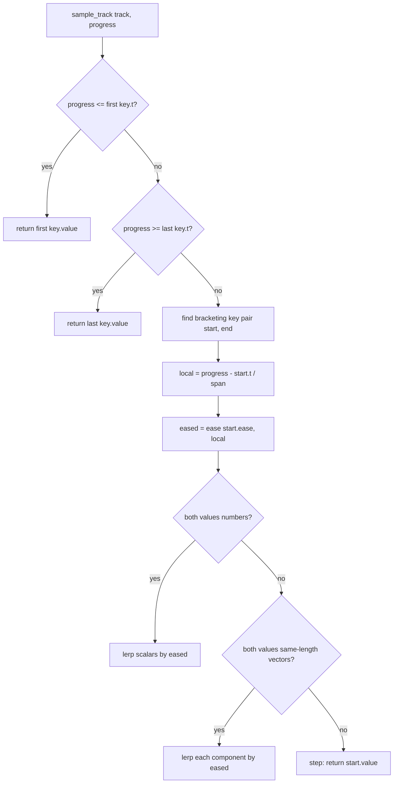

# Light Timeline — Flow

**About:** [description](../__about/animation.md)

## Algorithm — the fixed-timestep clock

Pseudocode:

    FUNCTION tick(elapsed_seconds):
        IF NOT playing → return False
        carry ← min(carry + elapsed_seconds, maxStep)
        step ← 1 / fps
        advanced ← False
        WHILE playing AND carry >= step:
            carry ← carry - step
            _advance(step × speed)
            advanced ← True
        RETURN advanced

    FUNCTION _advance(dt):
        time ← time + dt
        IF time < duration → return
        IF loop → time ← time MOD duration
        ELSE → time ← duration; playing ← False   # end-of-scene IS the next emitted state

Wall time accumulates in `carry` and is spent in whole `1/fps` steps, so the same scene evaluates at the same instants regardless of the host's actual frame rate — this is what keeps the LIGHT and WEB renderers agreeing on where a scene is at a given elapsed time, pinned by `tests/test_animation_parity.py`.

## Algorithm — sampling a track

Pseudocode:

    FUNCTION sample_track(track, progress):
        keys ← track.keys                      # sorted by t at load time
        IF progress <= keys[0].t   → RETURN keys[0].value
        IF progress >= keys[-1].t  → RETURN keys[-1].value

        (start, end) ← the key pair bracketing progress
        local ← (progress - start.t) / (end.t - start.t)
        eased ← ease(start.ease OR defaultEasing, local)

        IF start.value AND end.value are both numbers:
            RETURN start.value + (end.value - start.value) × eased
        IF start.value AND end.value are both vectors of the SAME length:
            RETURN [lerp each component by eased]      # e.g. part.position
        OTHERWISE:
            RETURN start.value                 # names, flags, mismatched shapes STEP

A **vector** is a fixed-length list of numbers — `part.position`'s `[x, y, z]`, the channel that lets a bead (Five Stations) or a seat (the Hexagram's collapse) SLIDE rather than only fade or step. It lerps component-wise by the identical eased fraction a scalar uses.
