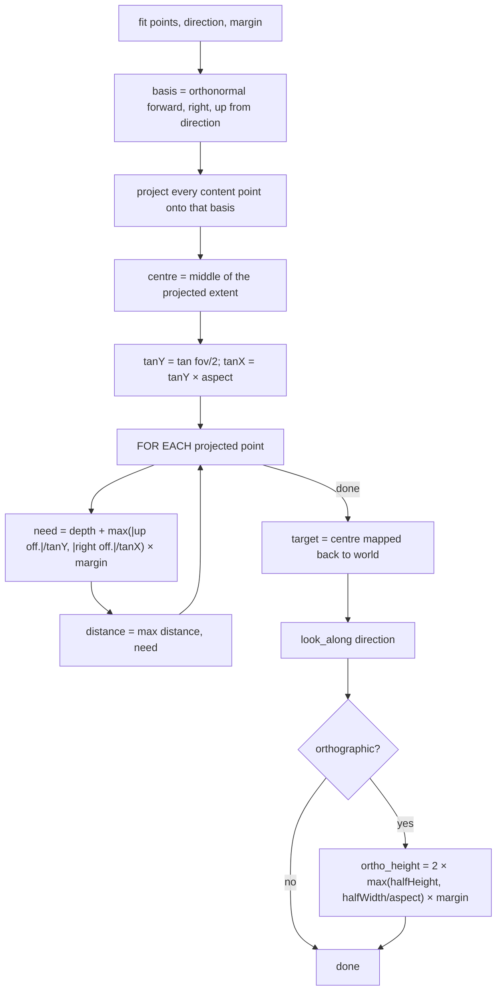

# Light Camera — Flow

**About:** [description](../__about/camera.md)

## Algorithm — framing content (`fit`)

Pseudocode:

    FUNCTION fit(points, direction, margin):
        (forward, right, up) ← orthonormal basis from direction
        projected ← [(dot(p, right), dot(p, up), dot(p, forward)) FOR p IN points]
        centre ← midpoint of projected extent on each axis

        tanY ← tan(fov / 2)
        tanX ← tanY × aspect
        distance ← 0
        FOR EACH (x, y, z) IN projected:
            need ← (z - centre.z) + max(|y - centre.y| / tanY, |x - centre.x| / tanX) × margin
            distance ← max(distance, need)

        target ← centre, mapped back into world space
        distance ← max(distance, MIN_DISTANCE)
        look_along(direction)                     # sets azimuth/elevation, clamped short of the poles
        IF orthographic:
            ortho_height ← 2 × max(halfHeight, halfWidth / aspect) × margin

This is **per-point, not aggregate**: `halfDepth + halfHeight / tan(fov/2)` — the naive single-formula version — assumes the widest point is also the nearest, which for anything viewed corner-on it is not, and wastes about a third of the frame. The same rule is implemented in the web core so a spec frames identically in both renderers.
