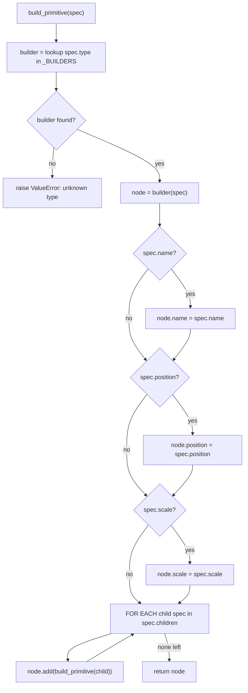
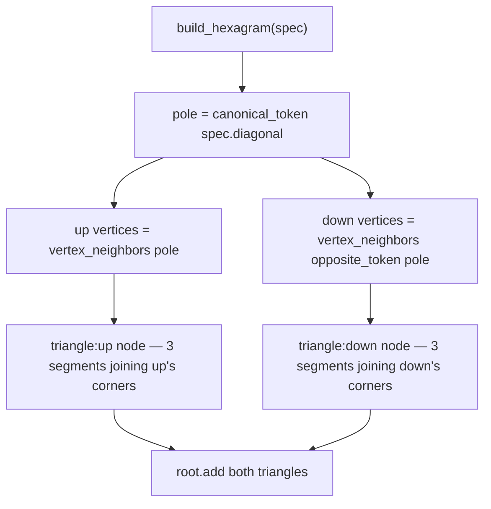

# Light Primitives — Flow

**About:** [description](../__about/primitives.md)

## Algorithm — spec to part tree (`build_primitive`)

Every primitive spec is turned into a `Node` tree the same way, regardless of which shape it builds: dispatch to the type's builder, then apply the universal fields, then recurse into any children.

Pseudocode:

    FUNCTION build_primitive(spec):
        builder ← _BUILDERS[spec.type]                 # axes | cube | group | marker | hexagram
        IF builder is None → raise "unknown primitive type"
        node ← builder(spec)                            # shape-specific geometry
        IF spec.name     → node.name = spec.name
        IF spec.position → node.position = spec.position
        IF spec.scale    → node.scale = spec.scale
        FOR EACH child_spec IN spec.children:
            node.add(build_primitive(child_spec))        # recursive — same function, any depth
        RETURN node

Each of the five builders (`build_axes`, `build_cube`, `build_group`, `build_marker`, `build_hexagram`) only ever produces the shape-specific geometry and sub-structure; the universal fields (name, position, scale, children) are applied once here, uniformly, so a builder never has to handle them itself.

## Algorithm — the hexagram overlay (`build_hexagram`)

Pseudocode:

    FUNCTION build_hexagram(spec):
        pole  ← canonical_token(spec.diagonal)           # one of the cube's 8 vertex tokens
        up    ← vertex_neighbors(pole)                   # the 3 vertices one flip away from pole
        down  ← vertex_neighbors(opposite_token(pole))    # the 3 vertices one flip away from the opposite pole

        FOR name, vertices, color IN [("triangle:up", up, upColor), ("triangle:down", down, downColor)]:
            corners ← [token_vector(v) × (size / 2) FOR v IN vertices]   # TRUE cube vertices, not an approximation
            node ← Node(name)
            node.segments ← [Segment(corners[i], corners[(i+1) mod 3]) FOR i IN 0..2]
            root.add(node)

Computed from the diagonal alone (Compute, Don't Generate (rules/CODE.md) — computed, not stored): each pole of the chosen body diagonal has three edge-neighbour vertices, and those two triangles ARE the six "equatorial face-diagonals" the Hexagram X-ray draws itself into. Each triangle is one `Node` holding its three segments, so a single `part.strokeProgress` on `hexagram/triangle:up` (or `:down`) draws all three sides at once — the "DRAW themselves" beat of Scene 1 (`SCENES.md`).
