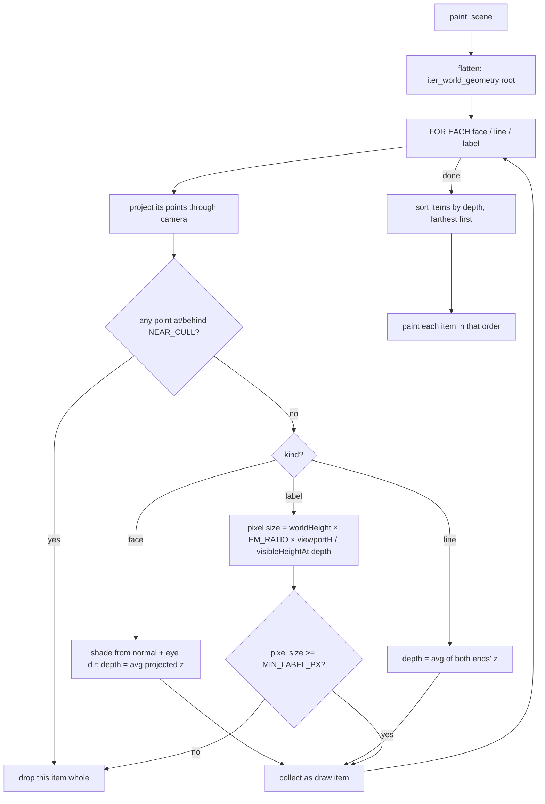

# Light Renderer — Flow

**About:** [description](../__about/renderer.md)

## Algorithm — the paint pass



Pseudocode:

    FUNCTION paint_scene(painter, root, camera, width, height, grid_segments):
        items ← []
        IF grid_segments → project and collect each as a faint line item

        FOR EACH (kind, data, color, opacity) IN iter_world_geometry(root):
            IF opacity <= 0.01 → skip
            project the item's points through camera.project(point, width, height)
            IF ANY projected point's depth <= NEAR_CULL → drop the WHOLE item (not just that point)
            IF kind == face:
                normal ← face normal, flipped toward the eye if needed (faces are double-sided)
                shade  ← ambient + diffuse × max(0, dot(normal, light direction))
                depth  ← average of the projected depths
            IF kind == line:
                depth ← average of the two endpoints' depths
            IF kind == label:
                pixels ← worldHeight × EM_RATIO × viewportHeight / visibleHeightAt(depth)
                IF pixels < MIN_LABEL_PX → drop (unreadable noise)
            items.append(item with its depth)

        SORT items BY depth, FARTHEST FIRST
        FOR EACH item IN sorted items:
            draw it (polygon fill, line stroke, or text)

A node's `segments` also read its own `stroke` (0..1, see [Light Scene](../__about/scene.md)): below `1.0`, each segment is shortened toward its own start by that fraction before projection; at `0.0` it is skipped entirely. This is the whole implementation of a line "drawing itself" — no separate animation path, just a smaller segment handed to the same projector.

## Algorithm — opacity propagation (`iter_world_geometry`)

```mermaid
flowchart TB
    A["walk(node, offset, basis, factor, opacity)"] --> B{node.visible?}
    B -- no --> Z[skip subtree entirely]
    B -- yes --> C["hereOpacity = opacity × node.opacity"]
    C --> D{hereOpacity <= INVISIBLE?}
    D -- yes --> Z
    D -- no --> E[hereOffset = offset + basis·(node.position × factor)]
    E --> F[hereBasis = compose basis, node.basis]
    F --> G[hereScale = factor × node.scale]
    G --> H[yield this node's faces / segments / labels transformed to world space]
    H --> I[FOR EACH child]
    I --> J["walk(child, hereOffset, hereBasis, hereScale, hereOpacity)"]
    J --> I
```

Pseudocode:

    FUNCTION walk(node, offset, basis, factor, opacity):
        IF NOT node.visible → return                       # whole subtree skipped
        hereOpacity ← opacity × node.opacity
        IF hereOpacity <= INVISIBLE → return                # whole subtree skipped, not per-polygon

        hereOffset ← offset + (basis applied to node.position × factor)
        hereBasis  ← compose(basis, node.basis)              # None stays None until a rotation appears
        hereScale  ← factor × node.scale

        YIELD this node's own faces/segments/labels, transformed by (hereOffset, hereBasis, hereScale)
        FOR EACH child IN node.children:
            walk(child, hereOffset, hereBasis, hereScale, hereOpacity)   # recurse, opacity keeps multiplying down

Opacity multiplies down the chain (`hereOpacity = opacity × node.opacity`), so dimming a group dims every descendant — and a branch multiplied down to at-or-below `_INVISIBLE` (0.01) is skipped WHOLE rather than transformed and then discarded polygon by polygon, which matters because a model view typically lights one family of thirteen axes and dims the rest to zero (root Priority A — this walk is the hot path, called every repaint).
