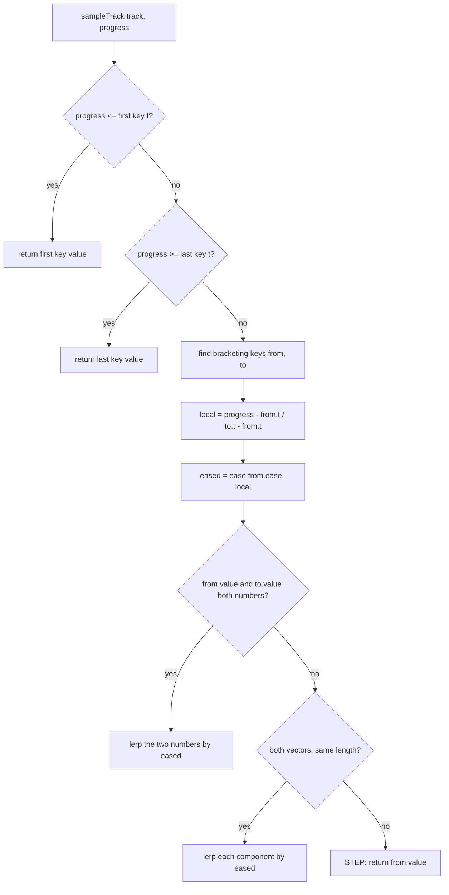

# Timeline — Flow

**About:** [description](../__about/animation.md)

## Algorithm

Pseudocode (language-neutral):

    FUNCTION sampleTrack(track, progress):
        keys ← track.keys, sorted by t
        IF progress <= keys[0].t → RETURN keys[0].value
        IF progress >= keys[last].t → RETURN keys[last].value
        (from, to) ← the consecutive key pair bracketing progress
        local ← (progress - from.t) / (to.t - from.t)
        eased ← ease(from.ease OR default, local)
        IF from.value AND to.value are both numbers:
            RETURN from.value + (to.value - from.value) × eased
        IF from.value AND to.value are both vectors of the SAME length:
            RETURN [lerp each component by eased]        # part.position slides
        OTHERWISE:
            RETURN from.value                              # names, flags, mismatched shapes STEP

    FUNCTION tick(elapsedSeconds):                          # the clock, fixed timestep
        carry ← min(carry + elapsedSeconds, maxStep)
        step ← 1 / fps
        moved ← false
        WHILE playing AND carry >= step:
            carry ← carry - step
            advance(step × speed)
            moved ← true
        RETURN moved

A key's easing governs the segment that **starts** at it, so the last key's easing is never used. A **vector** is a fixed-length array of numbers — `part.position`'s `[x, y, z]` — lerped component-wise by the identical rule a lone number follows; two vectors of different lengths cannot be lerped and step instead, the same fallback a name or a flag gets.
