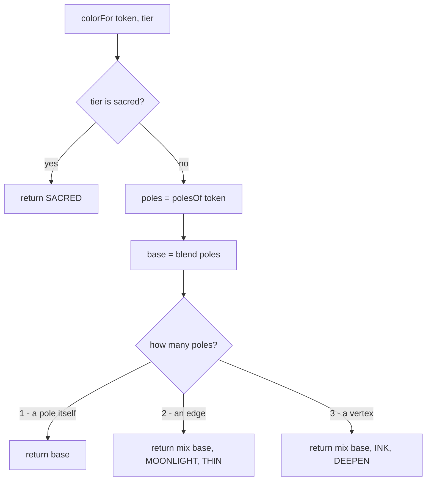

# Axis Colours — Flow

**About:** [description](../__about/axiscolors.md)

## Algorithm

Pseudocode (language-neutral):

    FUNCTION colorFor(token, tier):
        IF tier == 'sacred' → RETURN SACRED             # white-gold, outside the six
        poles ← the pole hues token lies between (its own letter order)
        base  ← per-channel mean of poles
        IF poles has 1 entry  → RETURN base              # the sealed pole hue itself
        IF poles has 2 entries → RETURN mix(base, MOONLIGHT, THIN)   # thinned edge
        OTHERWISE (3 entries)  → RETURN mix(base, INK, DEEPEN)       # deepened vertex

    FUNCTION verifyPalette(colors):                       # the collision rule
        FOR EACH (token, color) IN colors WHERE token is not a pole itself:
            FOR EACH (pole, poleColor) IN the six poles:
                IF distance(color, poleColor) < MIN_POLE_DISTANCE → COLLISION
        FOR EACH pair (tokenA, tokenB) IN colors, A before B:
            IF distance(colorA, colorB) < MIN_SEAT_DISTANCE → COLLISION
        IF any collision → throw, listing every one (never just the first)

The moonlight/ink move is what makes the FIRST check (no derived colour near a pole) hold by construction rather than luck; the SECOND check (`MIN_SEAT_DISTANCE`) exists because the closest legitimate pair — two body diagonals whose three poles are complementary — averages toward grey no matter how it is thinned, so it is checked and allowed to pass just above the threshold rather than avoided by a third rule.
