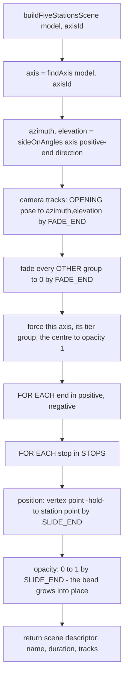

# Cinematics — Flow

**About:** [description](../__about/cinematics.md)

## Algorithm

Pseudocode (language-neutral):

    FUNCTION buildFiveStationsScene(model, axisId, duration):
        axis   ← the model's axis whose id or opposite end matches axisId (else fail, listing axes)
        tier   ← axis.tier;  length ← tier's length × model.size
        (azimuth, elevation) ← sideOnAngles(axis's positive-end direction)
                                 # a camera looking ACROSS the axis, not down it

        tracks:
            camera.azimuth / camera.elevation:  OPENING pose  →  (azimuth, elevation), eased, done by FADE_END
            FOR EACH group that is NOT this axis, its tier, or the centre:
                part.opacity:  1 → 0, eased, done by FADE_END      # "the cube fades to one line"
            part.opacity forced to 1 on: this axis's tier group, this axis, the centre
            FOR EACH end (positive, negative) OF axis:
                FOR EACH stop (luminous, fallen):
                    vertexPoint   ← direction × length              (radial factor 1.0)
                    stationPoint  ← direction × length × RADIAL[stop]
                    part.position:  vertexPoint → (hold until FADE_END) → stationPoint by SLIDE_END
                    part.opacity:   0 → 1 by SLIDE_END               # the bead grows into place

        RETURN {name, label, duration, loop: false, content: {type: 'model', view: 'cube'}, tracks}

`FADE_END` (0.35) and `SLIDE_END` (0.75) are fixed fractions of the scene's own duration, so "the cube is gone" and "the beads have arrived" always land at the same relative moments regardless of how long the scene plays.
