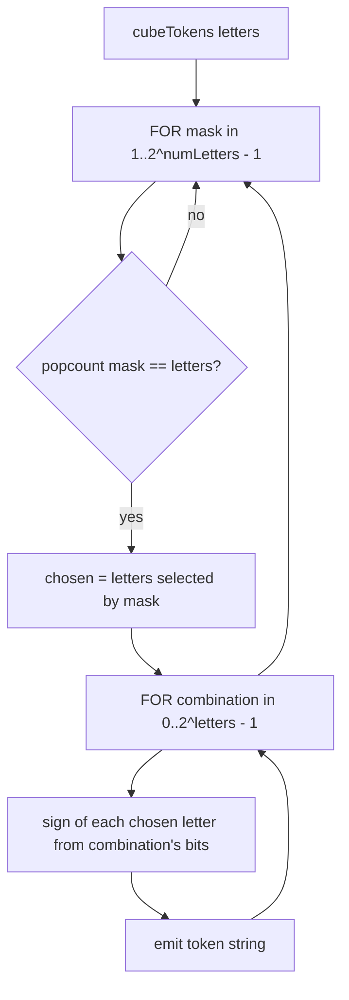

# Directions — Flow

**About:** [description](../__about/directions.md)

## Algorithm

Pseudocode (language-neutral):

    FUNCTION cubeTokens(letters):                     # 6 for 1, 12 for 2, 8 for 3
        tokens ← []
        FOR mask FROM 1 TO 2^numLetters - 1:
            chosen ← the letters whose bit is set in mask
            IF count(chosen) != letters → SKIP
            FOR combination FROM 0 TO 2^letters - 1:
                token ← chosen letters, each signed '+' or '-' by its bit in combination
                tokens.append(token)
        RETURN tokens

    FUNCTION vertexNeighbors(vertex):                  # the 3 vertices one edge away
        signed ← the 3 (letter, sign) pairs of vertex
        FOR index FROM 0 TO 2:
            flipped ← signed with ONLY letter[index]'s sign reversed
            neighbors.append(canonicalToken(flipped))
        RETURN neighbors

    FUNCTION hiddenFrom(vertex):                       # the 7 cells behind vertex's antipode
        antipode ← the 3 (letter, sign) pairs of oppositeToken(vertex)
        FOR count IN [1, 2, 3]:
            FOR EACH subset of antipode's letters of that count:
                hidden.append(canonicalToken(subset, same signs))
        RETURN hidden                                  # 1 (the antipode) + 3 (edges) + 3 (faces) = 7

`cubeTokens` never lists a direction; it enumerates every subset of the six letters of the requested size, then every sign combination for that subset — which is what makes 6/12/8 fall out of one loop rather than three tables. `vertexNeighbors` and `hiddenFrom` are the geometry the Hexagram X-ray and the Blindness view (19-of-26 visible) read directly.
