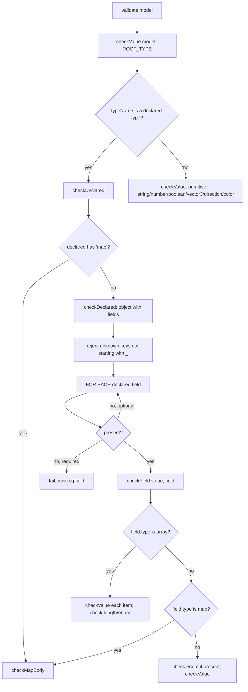

# Model — Flow

**About:** [description](../__about/model.md)

## Algorithm

Pseudocode (language-neutral — the four functions call each other, forming one recursive descent over the model tree):

    FUNCTION validate(model):
        checkValue(model, ROOT_TYPE, 'model')
        RETURN model

    FUNCTION checkValue(value, typeName, where):
        IF typeName is a declared type (has fields or is a map) → checkDeclared(value, TYPES[typeName], where)
        ELSE → check value against the PRIMITIVE typeName (string/number/boolean/vector3/direction/color),
               fail at `where` naming what was expected vs what was found

    FUNCTION checkDeclared(value, declared, where):
        IF declared IS a map shape → checkMapBody(value, declared, where); RETURN
        IF value is not a plain object → fail
        IF value has a key not in declared.fields and not starting with '_' → fail, listing allowed keys
        FOR EACH (name, field) IN declared.fields:
            IF name not in value:
                IF field.required → fail
                ELSE → skip
            ELSE → checkField(value[name], field, where + '.' + name)

    FUNCTION checkField(value, field, where):
        IF field.type == 'array':
            IF value is not a list → fail
            IF field has a 'length' and count mismatches → fail
            FOR EACH item, index IN value:
                checkValue(item, field.of, where + '[index]')
                IF field has an 'enum' and item not in it → fail
        ELIF field.type == 'map':
            checkMapBody(value, field, where)
        ELSE:
            IF field has an 'enum' and value not in it → fail
            checkValue(value, field.type, where)

    FUNCTION checkMapBody(value, field, where):
        IF value is not a plain object → fail
        IF field.keys is not '*':
            required ← the resolved key list (a literal list, `@spec.path`, or `$model.field`)
            IF value is missing any required key, or has an extra one → fail
        FOR EACH (key, item) IN value:
            checkValue(item, field.of, where + '.' + key)

Every failure names the exact `where` path, so a generated model's error points at one field, never at "the model" as a whole.
