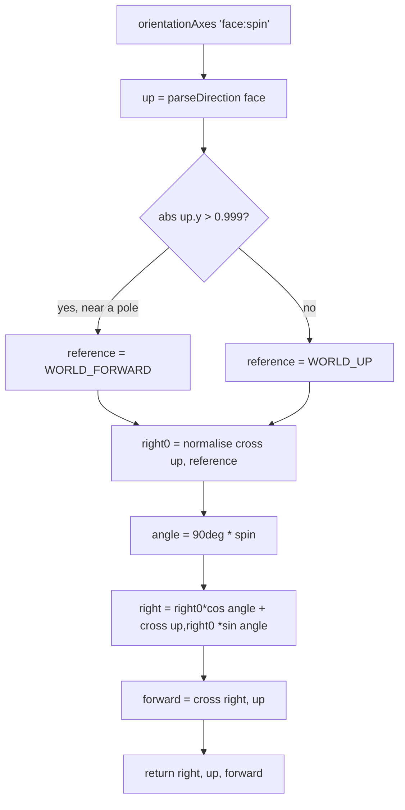

# Orientations — Flow

**About:** [description](../__about/orientations.md)

## Algorithm

Pseudocode (language-neutral):

    FUNCTION orientationAxes(identifier):             # "<face>:<spin>" → [right, up, forward]
        (face, spin) ← split identifier on ':'
        up ← parseDirection(face)                       # the cube's +Y goes here
        reference ← WORLD_FORWARD if |up.y| > 0.999 else WORLD_UP   # avoid a degenerate cross product
        right0 ← normalise(cross(up, reference))         # spin 0's right axis
        angle ← 90° × spin
        right ← right0 rotated by `angle` about `up`      # cos/sin combination of right0 and cross(up, right0)
        forward ← cross(right, up)
        RETURN [right, up, forward]

    FUNCTION snapAngles(direction):                    # camera angles to look DOWN direction
        (x, y, z) ← parseDirection(direction)
        horizontal ← hypot(x, z)
        azimuth   ← atan2(x, z) IF horizontal > 0 ELSE 0
        elevation ← atan2(y, horizontal) IF horizontal > 0 ELSE (±POLE_LIMIT, sign of y)
        RETURN {azimuth, elevation: clamp(elevation, -POLE_LIMIT, POLE_LIMIT)}

`orientationIds()` is just `FACE_ORDER × [0,1,2,3]` — the 6×4 = 24 product is why the module needs no stored table: picking a face is one choice, picking a spin about it is the other, and every orientation is exactly one of the 24 combinations.
