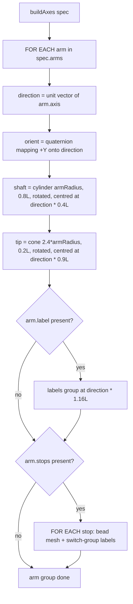
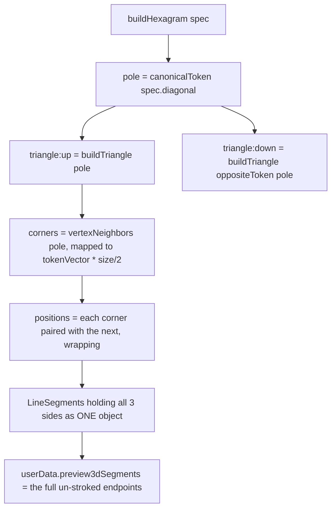

# Parametric Primitives — Flow

**About:** [description](../__about/primitives.md)

## Algorithm — One Arm of an Axes Gizmo

## Algorithm — The Hexagram's Two Triangles

Pseudocode (language-neutral):

    FUNCTION buildAxes(spec):
        FOR EACH arm IN spec.arms:
            direction ← unit vector of arm.axis            # a token or raw vector
            rotation  ← quaternion mapping world +Y onto direction
            shaft ← cylinder(armRadius, 0.8·armLength), rotated, centred at direction · 0.4·armLength
            tip   ← cone(2.4·armRadius, 0.2·armLength), rotated, centred at direction · 0.9·armLength
            IF arm.label → labels ← text sprites at direction · 1.16·armLength, one visible at a time
            FOR EACH stop IN arm.stops → a bead (sphere) at the stop's anchor, holding one label per register
        RETURN the group: joint? + one sub-group per arm

    FUNCTION buildHexagram(spec):
        pole ← canonicalToken(spec.diagonal)
        FOR (name, vertexToken) IN [('triangle:up', pole), ('triangle:down', oppositeToken(pole))]:
            corners ← vertexNeighbors(vertexToken) mapped to tokenVector(v) × size/2   # the TRUE cube vertex
            positions ← each corner paired with the NEXT corner (wrapping), 3 segments
            geometry ← ONE LineSegments holding all 3 segments
            geometry.userData.preview3dSegments ← the corners, unstroked — what setPartStroke() shortens FROM

`vertexNeighbors` (see [Directions — Flow](directions.md)) is what turns "the silhouette down a body diagonal splits into two triangles" from a per-scene coordinate list into three flips of the diagonal's own letters — the pole's own three edge-neighbours are one triangle, the antipode's own three the other.
