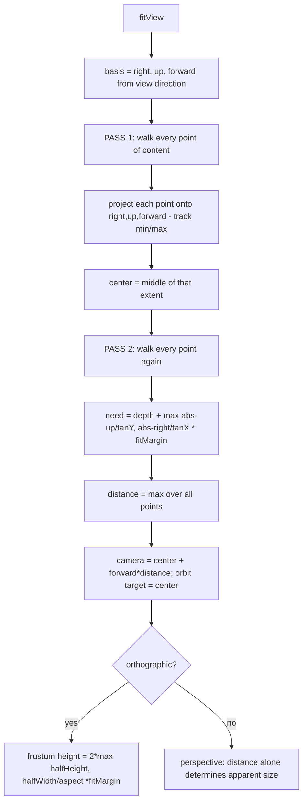
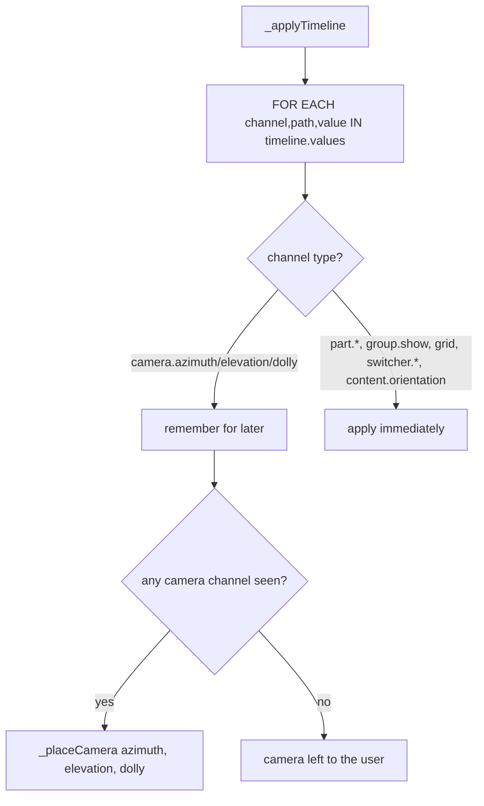

# Viewer — Flow

**About:** [description](../__about/viewer.md)

## Algorithm — Framing (`fitView`)

Measures the content's real **silhouette** from the view direction, then pulls the camera back until that silhouette fills the frustum — in BOTH axes, so a wide container is actually used.

Pseudocode (language-neutral):

    FUNCTION fitView():
        (right, up, forward) ← orthonormal basis from the view direction
                                 # forward points from the content toward the camera
                                 # world +Z replaces world up as the reference for a straight top/bottom view
        PASS 1 — extent:
            FOR EACH point OF content (real vertices for meshes; the four screen-parallel
                                        corners for billboard sprites, since they turn to
                                        face the camera and their world geometry says
                                        nothing about their size):
                project onto (right, up, forward) → track min/max
            center ← middle of that extent
        PASS 2 — distance:
            tanY ← tan(fov / 2);  tanX ← tanY × aspect
            FOR EACH point:
                need ← depth + max(|up offset| / tanY, |right offset| / tanX) × fitMargin
                distance ← max(distance, need)
        camera ← center + forward × distance;  orbit target ← center
        IF orthographic: frustum height ← 2 × max(halfHeight, halfWidth / aspect) × fitMargin

**Why not the bounding box or sphere** (a few lines shorter each): both measure the enclosing solid, not the shape. The axes gizmo's box corners sit at `(±L, ±L, ±L)` where the gizmo has nothing at all, framing it at roughly 55% of the space it should fill. **And why per-point rather than aggregate:** `halfDepth + halfHeight / tan(fov/2)` assumes the widest point is also the nearest, which for anything viewed corner-on it is not — that assumption alone costs about a third of the frame. Both passes run once per content swap, never per frame.

## Algorithm — Applying a Timeline Frame

Pseudocode (language-neutral):

    FUNCTION _applyTimeline():                          # runs once per resolved animation frame
        azimuth, elevation, dolly ← null, null, null
        FOR EACH {channel, path, value} IN timeline.values():
            SWITCH channel:
                'camera.azimuth'   → azimuth ← value
                'camera.elevation' → elevation ← value
                'camera.dolly'     → dolly ← value
                'camera.projection'→ setProjection(value)
                'part.opacity' / 'part.visible' / 'part.position' / 'part.strokeProgress'
                                   → apply directly to the named part
                'group.show'       → showOnly(path, value)
                'grid'             → setGrid(value) if it changed
                'switcher.register'/'switcher.reading' → setSwitcher(...)
                'content.orientation' → setOrientation(value)
                OTHERWISE          → throw (an unhandled channel is a bug, not a no-op)
        IF azimuth OR elevation OR dolly was seen:
            _placeCamera(azimuth ?? current, elevation ?? current, dolly)
                # dolly is a FACTOR of the baseline framing captured when the scene loaded —
                # apparent size is DISTANCE under perspective, FRUSTUM HEIGHT under orthographic

A scene with no camera tracks leaves the camera exactly where the user put it — the camera fields are collected across the whole frame first and applied once, rather than each track fighting the last for the camera.
